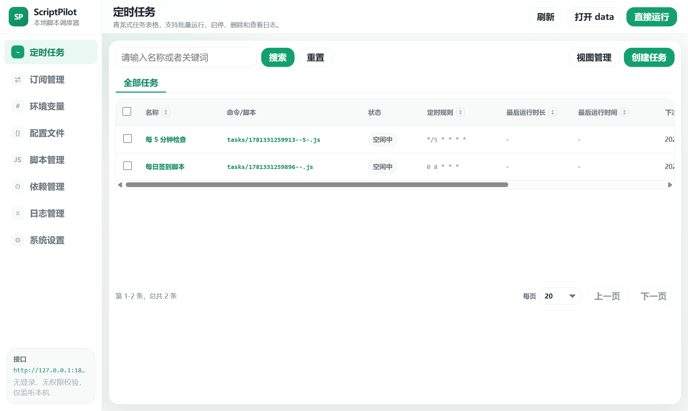
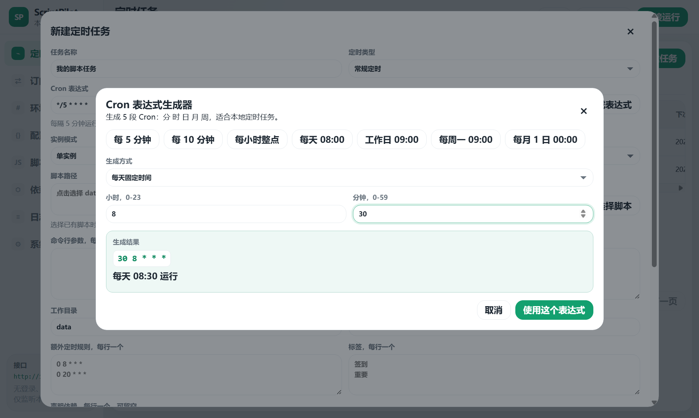

# ScriptPilot 使用说明

这是一份给普通用户看的傻瓜式教程。按步骤操作即可，不需要懂 Node、Electron、Windows 计划任务或命令行。

## 1. ScriptPilot 是什么

ScriptPilot 是一个 Windows 绿色便携版 NodeJS 脚本调度器。

你可以用它做这些事：

- 保存和管理本地 `.js` 脚本。
- 定时运行脚本。
- 手动运行脚本并查看日志。
- 从 GitHub 仓库、GitHub Raw 或普通 HTTP 地址拉取脚本。
- 给 GitHub 订阅拉取配置可选加速地址。
- 拉取订阅后，根据脚本里的 Cron 自动创建任务。
- 管理脚本运行需要的环境变量和 npm 依赖。
- 检查新版本并跳转下载更新。

软件主界面如下：



## 2. 下载和启动

1. 打开 ScriptPilot 的 GitHub Releases 页面。
2. 下载最新版 `ScriptPilot-v版本号-portable.zip`。
3. 右键压缩包，选择“全部解压”或用压缩软件解压。
4. 推荐解压到一个固定目录，例如 `D:\Tools\ScriptPilot`。
5. 双击最外层的 `ScriptPilot.exe`。

解压后目录应该长这样：

```text
ScriptPilot.exe
app/
```

请运行最外层的 `ScriptPilot.exe`，不要运行 `app/ScriptPilot.exe`。最外层程序是便携启动器，会保证数据写到当前目录下。

## 3. 数据保存在哪里

ScriptPilot 所有用户数据都保存在：

```text
app/data/
```

常用目录说明：

```text
app/data/state/          任务、订阅、变量、运行记录、设置
app/data/scripts/        手动保存或订阅拉取的脚本
app/data/configs/        配置文件
app/data/logs/           运行日志
app/data/node_modules/   自动安装或手动安装的 npm 依赖
app/data/repo/           Git 仓库订阅缓存
app/data/raw/            Raw 单文件订阅缓存
app/data/cache/          npm 等缓存
app/data/tmp/            临时文件
```

迁移到新电脑时，把整个解压目录带走即可。删除 `app/data` 会清空所有任务、变量、日志、脚本和设置。

## 4. 第一次使用建议

第一次打开后，建议按这个顺序熟悉：

1. 先进入“脚本管理”，保存一个简单测试脚本。
2. 再进入“定时任务”，用“选择已有脚本”创建任务。
3. 点击“运行”确认脚本能正常执行。
4. 点击任务行里的“日志”查看输出。
5. 不会写 Cron 时，用“生成表达式”生成定时规则。

测试脚本可以写：

```js
console.log('ScriptPilot 测试运行成功');
console.log(new Date().toLocaleString());
```

## 5. 定时任务

定时任务页面用于管理所有脚本任务。

常见操作：

- “创建任务”：新建一个定时任务。
- “运行”：立即执行一次任务。
- “日志”：用弹窗查看任务运行日志。
- “编辑”：修改任务名称、脚本、Cron、参数等。
- “启用/禁用”：控制任务是否参与定时调度。
- “删除”：删除任务，不会自动删除脚本文件。
- “批量运行/批量启用/批量禁用/批量删除”：先勾选任务，再执行批量操作。
- 点击带排序图标的列头：按任务名、定时规则、耗时、上次运行、下次运行、置顶状态排序。

任务列表中的脚本路径会隐藏前缀 `data/scripts/`，这样列表更清爽。实际运行时仍然会使用 `app/data/scripts/` 下的脚本文件。

## 6. 创建任务时怎么选脚本

点击“创建任务”后，重点看“脚本来源”。

### 选择已有脚本

这是推荐方式。

1. “脚本来源”选择“选择已有脚本”。
2. 点击“选择脚本”。
3. 在树型弹窗里勾选 `data/scripts` 下的脚本。
4. 可以只选一个，也可以多选。
5. 点击“使用选中脚本”。
6. 填写任务名称和 Cron。
7. 点击“保存任务”。

选择已有脚本时，页面会隐藏“脚本内容”输入框。任务只记录脚本路径，不会复制脚本内容。

多选脚本时，会批量创建任务。每个脚本会生成一个任务，任务名称会尽量按脚本名或脚本里的任务名生成。

### 填写新脚本内容

适合临时写一个小脚本。

1. “脚本来源”选择“填写新脚本内容”。
2. 页面会显示“脚本内容”输入框。
3. 填写 JavaScript 代码。
4. 保存任务后，ScriptPilot 会把脚本内容保存到任务脚本文件里。

如果你已经有脚本文件，不建议同时填路径和内容。现在界面会根据“脚本来源”只显示当前需要填写的内容，避免误填。

任务表单里部分字段旁边有信息图标。鼠标移上去、键盘聚焦或点击图标时，会显示这个字段的用途说明；按 `Esc` 可以关闭提示。

## 7. Cron 表达式生成器

Cron 用来表示“什么时候运行任务”。不会写也没关系，点击任务弹窗里的“生成表达式”即可。



使用步骤：

1. 打开“创建任务”或“编辑任务”。
2. 点击 Cron 输入框右侧的“生成表达式”。
3. 选择生成方式。
4. 填写小时、分钟、星期或日期。
5. 看“生成结果”和中文说明是否符合预期。
6. 点击“使用这个表达式”。

常用规则示例：

```text
*/5 * * * *       每 5 分钟运行
0 * * * *         每小时整点运行
0 8 * * *         每天 08:00 运行
0 9 * * 1-5       工作日 09:00 运行
0 9 * * 1         每周一 09:00 运行
0 0 1 * *         每月 1 日 00:00 运行
```

ScriptPilot 使用 5 段 Cron：

```text
分 时 日 月 周
```

如果输入错误，例如少一段、分钟超出范围、写成 `/5 * * * *`，保存时会提示错误，不会创建无效任务。

## 8. 额外定时规则

任务表单里有“额外定时规则，每行一个”。

它的作用是让同一个任务拥有多个触发时间。

例子：

```text
0 8 * * *
0 20 * * *
```

表示除了主 Cron 以外，还会每天 08:00 和 20:00 再运行一次。

注意：

- 每行只能写一个 5 段 Cron。
- 额外定时规则不支持 `@once` 或 `@boot`。
- 写错会在保存时提示，不会静默失败。

## 9. 手动运行任务和查看日志

运行任务：

1. 进入“定时任务”。
2. 找到任务。
3. 点击“运行”。
4. 等待状态变化。

查看日志：

1. 点击任务行里的“日志”。
2. 日志会用弹窗显示。
3. 运行中的任务会实时刷新日志。
4. 可以点击“复制日志”复制当前输出。
5. 可以点击“在日志页打开”跳到“日志管理”页面。

日志里通常包含：

- stdout：脚本正常输出。
- stderr：脚本错误输出。
- 退出码。
- 开始时间、结束时间、耗时。

## 10. 直接运行脚本

顶部有“直接运行”按钮。

适合临时测试脚本，不一定要创建定时任务。

可以选择两种方式：

- 填“脚本路径”：运行 `data/scripts` 下已有脚本。
- 填“脚本内容”：直接运行当前输入的代码，填写内容后优先运行内容。

直接运行也支持：

- 命令行参数，每行一个。
- 结构化参数 JSON。
- 工作目录。
- 声明依赖。
- 缺依赖时自动安装。

输入错误时会提示，例如 JSON 格式错误、路径不在便携目录内、路径不是 `.js` 文件等。

## 11. 脚本管理

脚本管理页面用于维护 `app/data/scripts` 下的文件。

常见操作：

- “新建”：新建一个脚本。
- “保存脚本”：保存当前编辑器内容。
- “运行”：直接运行当前脚本。
- “删除”：删除当前脚本。
- “打开目录”：打开 `data/scripts` 目录。
- “打开所在目录”：打开当前脚本所在文件夹。
- 左侧树型列表：浏览文件夹和脚本。
- 勾选脚本：批量运行或批量删除。

脚本路径建议写成：

```text
data/scripts/example.js
data/scripts/jd/example.js
```

也可以只写相对脚本路径，界面会尽量规范到 `data/scripts` 下。

不要填写：

```text
C:\Users\xxx\Desktop\a.js
..\outside.js
```

这些路径不在便携目录内，保存或运行时会被拦截。

## 12. 订阅管理

订阅管理用于从远程拉取脚本。

支持的常见地址：

```text
https://github.com/owner/repo.git
https://github.com/owner/repo
owner/repo
owner/repo.git
https://raw.githubusercontent.com/owner/repo/branch/path/file.js
https://example.com/file.js
```

新建订阅步骤：

1. 进入“订阅管理”。
2. 点击“新建订阅”。
3. 填写订阅名称。
4. 填写订阅地址。
5. Git 仓库可填写分支，不确定可先留空。
6. 如果要让订阅自己定时拉取，填写订阅 Cron。
7. 如果希望拉取后自动创建任务，勾选“拉取后按脚本 cron 自动创建任务”。
8. 点击“保存订阅”。
9. 在订阅列表点击“运行”。
10. 查看订阅日志，确认拉取成功。

拉取后的脚本通常会在：

```text
app/data/scripts/订阅名称/
```

订阅日志会用弹窗显示，包含拉取地址、目标目录、成功数量、失败信息和自动建任务结果。

### GitHub 拉取加速

订阅管理页面上方有“GitHub 拉取加速”配置。

默认不填，ScriptPilot 会直接连接 GitHub。网络不好时可以这样设置：

1. 进入“订阅管理”。
2. 在“GitHub 拉取加速”里填写加速地址，例如 `https://ghfast.top/`。
3. 也可以只填 `ghfast.top`，保存后会自动补全为 `https://ghfast.top/`。
4. 点击“保存”。
5. 再运行 GitHub 仓库或 GitHub Raw 订阅。

说明：

- 留空表示默认直连。
- 这个配置只用于 GitHub 仓库和 GitHub Raw 拉取失败后的重试。
- 普通 HTTP 脚本地址不会强制走 GitHub 加速。
- 订阅日志里会显示当前使用的 GitHub 加速地址，方便确认配置是否生效。

## 13. 订阅自动创建任务

勾选“拉取后按脚本 cron 自动创建任务”后，ScriptPilot 会扫描拉取到的 `.js` 文件。

它会识别脚本里的 Cron，例如：

```js
// cron "0 8 * * *"
```

或：

```js
// cron: 0 8 * * *
```

或：

```js
// @cron 0 8 * * *
```

任务名称会优先读取脚本里的：

```js
const $ = new Env('示例任务名称');
```

这个例子会创建名为“示例任务名称”的任务。

如果脚本没有 `new Env('任务名')`，会按脚本文件名生成任务名。

自动创建规则：

- 有有效 Cron 的脚本才会创建任务。
- 没有 Cron 的脚本会跳过。
- Cron 写错的脚本会跳过，并在日志里显示原因。
- 已由该订阅创建过的任务会自动更新名称和 Cron。
- 不会给没有定时信息的脚本乱建任务。

创建完成后，不需要刷新页面，定时任务列表会自动更新。如果网络慢或脚本很多，等订阅运行完成后再切换到“定时任务”查看。

## 14. 环境变量

环境变量用于给脚本提供账号、Cookie、Token 等配置。

新建环境变量：

1. 进入“环境变量”。
2. 点击“新建变量”。
3. 填写变量名称，例如 `JD_COOKIE`。
4. 填写变量值。
5. 填写备注，方便自己识别。
6. 状态选择“启用”。
7. 点击“保存变量”。

脚本运行时，会自动读取启用状态的环境变量。

如果有多个同名变量，运行时会用 `&` 拼接，方便脚本一次读取多份同类配置。

输入校验：

- 变量名不能为空。
- 变量名不能包含空格。
- 变量值建议不要留空。

## 15. 配置文件

配置文件页面管理 `app/data/configs` 下的文件。

常见用途：

- 保存脚本读取的配置。
- 编辑类似 `config.sh` 的文件。
- 存放一些不想写进脚本里的文本配置。

使用方式：

1. 进入“配置文件”。
2. 左侧选择文件。
3. 右侧编辑内容。
4. 点击“保存配置”。

## 16. 依赖管理

如果脚本里使用了 `axios`、`dayjs` 等 npm 包，需要安装依赖。

手动安装：

1. 进入“依赖管理”。
2. 在输入框填包名，例如 `axios`。
3. 点击“安装依赖”。
4. 等待表格显示安装成功。

自动安装：

- 直接运行脚本或运行任务时，如果勾选自动安装，ScriptPilot 会检查缺失依赖并安装到 `app/data/node_modules`。
- 如果脚本运行时才暴露缺失依赖，也会尝试补装后重试。

依赖不会安装到系统 Node，也不会污染全局环境。

## 17. 日志管理

日志管理页面可以查看历史运行记录。

使用方式：

1. 进入“日志管理”。
2. 左侧选择运行记录。
3. 右侧查看日志详情。
4. 点击“复制日志”可复制当前日志。

如果任务运行失败，优先查看这里的 stderr 和报错堆栈。

## 18. 系统设置

系统设置里可以查看：

- 程序目录。
- 数据目录。
- 内置运行时目录。
- 本机 API 地址。
- 软件更新。
- 网络加速。
- 开机启动状态。
- 日志清理配置。
- 外观设置。

### 软件更新

在“系统设置”里找到“软件更新”。

使用方式：

1. 点击“检查更新”。
2. 如果发现新版本，会弹出更新窗口。
3. 先看更新说明，确认是否需要升级。
4. 点击“下载新版”会打开下载链接。
5. 点击“打开发布页”可以查看 GitHub Release 页面。

下载新版时，下载链接会自动使用 `https://ghfast.top/` 加速，不需要手动改地址。

如果提示没有新版本，说明当前已经是最新版本。

### 网络加速

“系统设置”里的“网络加速”和“订阅管理”页上方的“GitHub 拉取加速”是同一份设置。

使用方式：

1. 填写 GitHub 加速地址，例如 `https://ghfast.top/`。
2. 点击“保存网络设置”。
3. 以后拉取 GitHub 订阅时，直连失败会自动用这个地址重试。
4. 如果不想使用加速，清空输入框再保存。

这个设置默认是空的，不会强制所有用户走加速地址。

日志清理默认启用，会删除过期运行记录和日志文件。你可以调整保留天数和清理周期。

本机 API 默认地址类似：

```text
http://127.0.0.1:18760
```

它只监听本机，适合本机工具或脚本调用。不要把它暴露到公网。

## 19. 输入框校验说明

ScriptPilot 会尽量在保存前拦截明显错误。

常见校验包括：

- 任务名称不能为空。
- Cron 必须是合法 5 段表达式。
- 额外定时规则必须逐行合法。
- JSON 参数必须是合法 JSON。
- 超时时间不能是负数。
- 脚本路径必须在便携目录内。
- 脚本路径建议是 `.js` 文件。
- 选择已有脚本时必须选择脚本。
- 填写新脚本内容时脚本内容不能为空。
- 订阅名称不能为空。
- 订阅地址不能为空。
- 订阅定时规则如果填写，必须是合法 Cron。
- 环境变量名称不能为空。
- npm 包名不能为空，不能乱填空格。

如果看到右下角提示或弹窗提示，按提示改正后再保存。

## 20. 常见问题

### 启动器图标是空白怎么办？

Windows 可能缓存了旧图标。可以尝试重新解压、删除旧快捷方式后重新创建快捷方式，或者重启资源管理器。

### 启动时提示本机接口端口被占用怎么办？

ScriptPilot 默认使用 `127.0.0.1:18760`。如果旧目录或另一个 ScriptPilot 还在运行，新程序启动时会提示端口被占用。

处理方法：

1. 先关闭正在运行的 ScriptPilot。
2. 如果任务栏或托盘里还有旧实例，也一起退出。
3. 确认只从当前目录的 `ScriptPilot.exe` 启动。
4. 重新打开程序。

### 为什么我创建的任务没有自动运行？

检查这几项：

1. 任务状态是否为“启用”。
2. Cron 是否正确。
3. 当前时间是否已经到达触发时间。
4. 程序是否正在运行。
5. 日志里是否有错误。

### 订阅拉取成功但没有自动创建任务？

检查这几项：

1. 订阅是否勾选“拉取后按脚本 cron 自动创建任务”。
2. 脚本里是否有可识别的 Cron 注释。
3. Cron 是否有效。
4. 脚本是否是 `.js` 文件。
5. 订阅日志里是否显示“无 cron”或“无效 cron”。

没有 Cron 的脚本不会自动创建任务，这是为了避免乱建无效任务。

### 自动创建的任务名称为什么不是中文？

只有脚本里写了类似下面的代码，才会优先使用中文名：

```js
const $ = new Env('示例任务名称');
```

如果没有这行，会按脚本文件名生成任务名。

### 发布包会不会带本地数据？

不会。发布包会排除 `app/data`，不会包含本机任务、CK、变量、日志、缓存和临时文件。

### 能不能把程序放到移动硬盘？

可以。保持 `ScriptPilot.exe` 和 `app/` 在同一个目录即可。

### 可以运行不可信脚本吗？

不建议。ScriptPilot 是本机工具，脚本能访问本机文件和网络。只运行你信任的脚本。

## 21. 推荐使用流程

日常使用建议这样做：

1. 先在“脚本管理”保存脚本。
2. 在“环境变量”填好脚本需要的变量。
3. 在“定时任务”选择已有脚本创建任务。
4. 用 Cron 生成器生成定时规则。
5. 手动运行一次任务。
6. 查看日志确认成功。
7. 确认无误后保持任务启用。

订阅脚本建议这样做：

1. 在“订阅管理”新建订阅。
2. 勾选自动创建任务。
3. 手动运行订阅。
4. 查看订阅日志，确认拉取成功和自动建任务结果。
5. 切到“定时任务”检查新任务。
6. 手动运行一个任务确认脚本可用。
